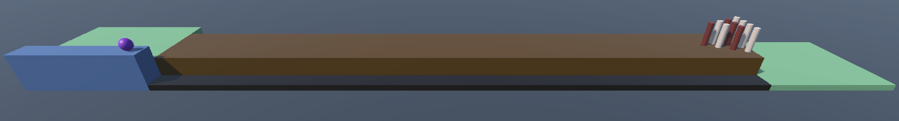

# BowlingWebXR

## Table of Contents

0. [Introduction](#introduction)
1. [Learning](#learning)
2. [Getting Started](#getting-started)
3. [Controls](#controls)
4. [Authors](#authors)
5. [About Me](#about-me)
6. [License](#license)

## Introduction

**BowlingWebXR** One of the hurdles in the widespread adoption of AR/VR technology is the necessity to download applications or executables to a device in order to experience it. With WebXR, these experiences could be hosted on web pages, making them more accessible to more people. In this project, the emphasis will be on developing an experience that runs in a headset browser and can fall back to keyboard/mouse controls when viewed on a computer. WebXR technology and standards are constantly changing we will be utilizing Unity 6 and [WebXR Export](https://openupm.com/packages/com.de-panther.webxr/) for Unity for this project. This Unity package is in active development, make sure to [read the docs](https://github.com/De-Panther/unity-webxr-export/tree/master/Documentation) and check the samples provided. Instead of providing a standalone build, we will use Github Pages (or any webhosting service of your choice) to host the project. Make sure you have the module for WebGL builds added to your Unity installation.

## Learning

- What is WebGL
- What is polyfill
- How to deploy for WebGL from Unity
- What is WebXR and what is its purpose
- How to design and accommodate for both VR input and keyboard/mouse input
- What is OpenUPM

## Getting Started

- Create a new Unity Project using Unity 6. Make sure to select the URP 3D project template.
- Make sure your Build Settings are set to WebGL.
- Import the Unity WebXR Exporter and WebXR Interactions packages with your choice of Git or OpenUPM (suggested). [Read the docs](https://immersiveweb.dev/#unity)to set up your project, scene, and WebGL templates.
- scene should render both in VR and in a browser. The web page must allow the user to enter/exit an immersive VR view if the browser supports it. We strongly encourage you to build, upload, and test your project in both headset and browser as you proceed through the tasks.

## Authors

Collin Ballard [GitHub](https://github.com/Collinb190)

## About Me

Hello! I am Lin, a passionate game developer with a love for creating engaging experiences. I have a background in Unity as well as
Web Development and I enjoy bringing my ideas to life. You can connect with me on [LinkedIn](https://www.linkedin.com/in/collin-ballard), 
[LinkWithLin](https://www.linkwithlin.com/), and check out my [Portfolio Project Repository](https://github.com/Collinb190).

## License

No formal license is required
